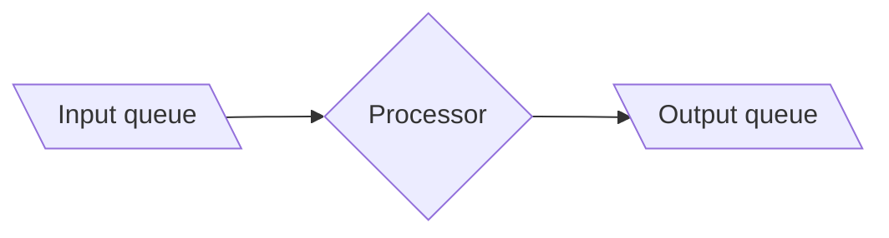

# Elastically scalable thread pools

*PLEASE DON'T SHARE JUST YET, WRITE UP STILL IN PROGRESS!*

An experiment in controlling the size of a thread pool using a PID controller.

## Motivation

Imagine a situation where you got some input queue, some processor of those
inputs and an output queue where the processor writes its results:




* Split work up in stages, pipelining
* If one stage is slow, throw an extra thread on it
* Spin up more threads
  - decrease latency (waiting time in the queue)
  - increase throughput (more enqueued items processed)
* Spin down threads
  - let some other stage use the CPU resources
  - save energy/money

## Plan

* One stage of a pipeline

```
   --->[In queue]--->[Worker pool]--->[Out queue]--->
```

* if in queue grows/shrinks, increase/decrease amount of workers in the pool

* use PID controller to stabilise amount of workers even though work fluctuates

```
                                            +----------------------------------+
                                            |                                  |
    -------------------------------------------->[In queue]--->[Worker pool]------->[Out queue]--->
                                            |                                  |
     r(t)   e(t)                    u(t)    |                                  |
    ----->+------>[PID controller]--------> |                                  |
          ^                                 |                                  |
          |                                 +----------------------------------+
          |                                                 | y(t)
          +-------------------------------------------------+

```

## Pseudo-code

Let's start top-down with the `main` function which drives our whole experiment.

### Main

```
main =

  // Create the in- and out-queues.
  inQueue  := newQueue()
  outQueue := newQueue()


  // The workers don't do anything interesting, they merely sleep for a bit to
  // pretend to be doing some work.
  worker := sleep 0.025s

  // Create an empty worker pool.
  pool := newPool(worker, inQueue, outQueue)

  // Start the PID controller in a background thread. The parameters provided
  // here allow us to tune the PID controller, we'll come back to them later.
  kp := 1
  ki := 0.05
  kd := 0.05
  dt := 0.01s
  fork(pidController(kp, ki, kd, dt, pool))


  // Create a workload for our workers. We use the sine function to create
  // between 0 and 40 work items every 0.1s for 60s. The idea being that because
  // the workload varies over time the PID controller will have some work to do
  // figuring out how many workers are needed.
  sineLoadGenerator(inQueue, 40, 0.1s, 60s)
```

### Worker pool

The worker pool itself is merely a struct which packs up the necessary data we
need to be able to scale it up and down.

```
struct Pool =
  { inQueue:  Queue<Input>
  , outQueue: Queue<Output>
  , worker:   Function<Input, Output>
  , pids:     List<ProcessId>
  }
```

Creating a `newPool` creates the struct with an empty list of process ids.

```
newPool worker inQueue outQueue = Pool { ..., pids: emptyList }
```

Scaling up and down are functions that take and return a `Pool`.

```
scaleUp pool =
  work := forever
            x := readQueue(pool.inQueue)
            y := pool.worker(x)
            writeQueue(pool.outQueue, y)
  pid   := fork(work)
  pool' := pool.pids = append(pid, pool.pids)
  return pool'
```

The function `scaleDown` does the inverse, i.e. kills and removes the last
process id from `pool.pids`.

### Load generator

In order to create work load that varies over time we use the sine function. The
sine function oscillates between $-1$ and $1$:


We would like to have it oscillate between $0$ and some max value $m$. By
multiplying the output of the sine function by $m/2$ we get an oscillation
between $-m/2$ and $m/2$, we can then add $m/2$ to make it oscillate between $0$
and $m$.

We'll sample the resulting function once every `timesStep` seconds, this gives
us the amout of work items (`n`) to create we then spread those out evenly in
time, rinse and repeat until we reach some `endTime`.

```
sineLoadGenerator inQueue workItem maxItems timeStep endTime =
  for t := 0; t < endtime; t += timeStep
    n := sin(t) * maxItems / 2 + maxItems / 2
    for i := 0; i < n; i++
      writeQueue(inQueue, workItem)
      sleep(timeStep / n)
```

### PID controller

https://en.wikipedia.org/wiki/PID_controller#Pseudocode

    Kp - proportional gain
    Ki - integral gain
    Kd - derivative gain
    dt - loop interval time (assumes reasonable scale)[c]

```
previous_error := 0
integral := 0
loop:
   error := setpoint − measured_value
   proportional := error;
   integral := integral + error × dt
   derivative := (error − previous_error) / dt
   output := Kp × proportional + Ki × integral + Kd × derivative
   previous_error := error
   wait(dt)
   goto loop
```

## How it works

We start off by only setting the proportional part and keeping the integral and
derivative part zero, this is called a P-controller. We see below that it will
scale the worker count up and down proportionally to the sine wave shaped load:


A P-controller only focuses on the *present*. In order to smooth things out we
introduce the integral part, i.e. a PI-controller. The integral part takes the
*past* into account. We see now that the worker count stabilises at 28:


We can improve on this by adding the derivative part which takes the *future*
into account. We then see that it stabilises at 26 workers:


With the full PID-controller, which stabilises using less workers than the
PI-controller, we see that the queue length spikes up to 20 or so each time the
work load generator hits one of the sine function's peaks.

## Usage

The above graphs were generated by running: `cabal run app -- kp ki kd`, where
the $K_p$, $K_i$, and $K_d$ parameters are the tuning parameters for the
PID-controller.

If you don't have the GHC Haskell compiler and the `cabal` build tool already
installed, then the easiest way to get it is via
[`ghcup`](https://www.haskell.org/ghcup/). Alternatively if you got `nix` then
`nix-shell` should give give you access to all the dependencies you need.

## Contributing

* Max number of threads

* Determinism, shards (odd/even, mod N) instead of pools a la Disruptor
  - orthonogal
  - but makes testing easier

* Larger pipelines, is it enough to control each individual stage separately?

* Controlling other things, e.g. batch size?

* Is it robust to wildly changing usage patterns?
  - [Slashdot effect](https://en.wikipedia.org/wiki/Slashdot_effect)
  - Bursty traffic

* We've looked at scaling up and down on a single machine (vertical scaling),
  what about scaling out and in across multiple machines (horizontal scaling)?

* Simulate rather than generate load

* More principled way of tuning the PID controller?
  https://en.wikipedia.org/wiki/PID_controller#Overview_of_tuning_methods

## See also

While control theory is sometimes mentioned in the context of distributed
systems, I haven't really seen it be used for simple things like controlling the
size of a thread pool before. Perhaps it's because when you get to the scale
where control theory is necessary then the examples are not so easy to explain
in an understandable way anymore. Either way the following, pretty well cited,
[survey](https://www.researchgate.net/publication/265611546_A_Review_of_Auto-scaling_Techniques_for_Elastic_Applications_in_Cloud_Environments)
of auto-scaling techniques does mention PID-controllers.

The paper that I got the idea from, [SEDA: An Architecture for Well-Conditioned
Scalable Internet
Services](https://people.eecs.berkeley.edu/~brewer/papers/SEDA-sosp.pdf),
doesn't really use control theory but rather a threshold approach (also
discussed in the above mentioned survey paper):

> The controller periodically samples the input queue (once per second by
> default) and adds a thread when the queue length exceeds some threshold (100
> events by default). Threads are removed from a stage when they are idle for a
> specified period of time (5 seconds by default).

The SEDA authors do however say that:

> Under SEDA, the body of work on control systems can be brought to bear on
> service resource management, and we have only scratched the surface of the
> potential for this technique.

A bit more explaination is provided by Matt Welsh, who is one of the author, in
his PhD
[thesis](https://cs.uwaterloo.ca/~brecht/servers/readings-new/mdw-phdthesis.pdf)
(2002):

> A benefit to ad hoc controller design is that it does not rely on complex
> models and parameters that a system designer may be unable to understand or to
> tune. A common complaint of classic PID controller design is that it is often
> difficult to understand the effect of gain settings.

So I think it's a valid approach. It could be that classic PID-controllers are
not suitable for the unpredictable internet traffic loads, but I'd be surprised
if more [advanced](https://users.ece.cmu.edu/~koopman/des_s99/control_theory/)
([robust](https://en.wikipedia.org/wiki/Robust_control) or
[adaptive](https://en.wikipedia.org/wiki/Adaptive_control)) control theory
hasn't already dealt with similar problems.
