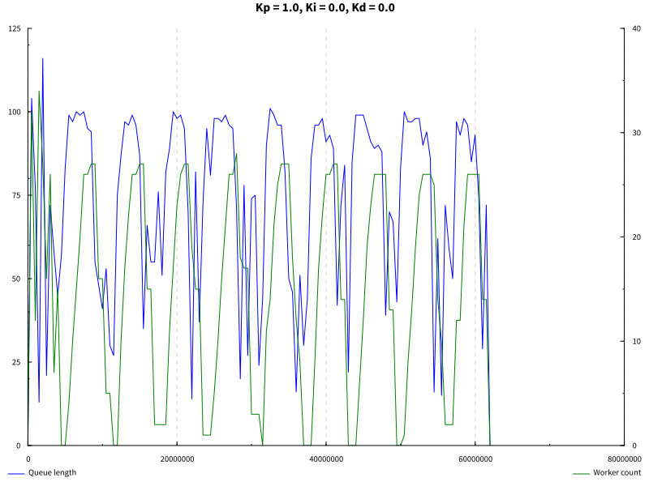

# Elastically scalable thread pools

*PLEASE DON'T SHARE JUST YET, WRITE UP STILL IN PROGRESS!*

An experiment in controlling the size of a thread pool using a PID controller.

## Motivation

* Split work up in stages, pipelining
* If one stage is slow, throw an extra thread on it
* Spin up more threads
  - decrease latency (waiting time in the queue)
  - increase throughput (more enqueued items processed)
* Spin down threads
  - let some other stage use the CPU resources
  - save energy/money

## Plan

* One stage of a pipeline

```
   --->[In queue]--->[Worker pool]--->[Out queue]--->
```

* if in queue grows/shrinks, increase/decrease amount of workers in the pool

* use PID controller to stabilise amount of workers even though work fluctuates

```
                                            +----------------------------------+
                                            |                                  |
    -------------------------------------------->[In queue]--->[Worker pool]------->[Out queue]--->
                                            |                                  |
     r(t)   e(t)                    u(t)    |                                  |
    ----->+------>[PID controller]--------> |                                  |
          ^                                 |                                  |
          |                                 +----------------------------------+
          |                                                 | y(t)
          +-------------------------------------------------+

```

## Pseudo-code

Let's start top-down with the `main` function which drives our whole experiment.

### Main

```
main =

  // Create the in- and out-queues.
  inQueue  := newQueue()
  outQueue := newQueue()


  // The workers don't do anything interesting, they merely sleep for a bit to
  // pretend to be doing some work.
  worker := sleep 0.025s

  // Create an empty worker pool.
  pool := newPool(worker, inQueue, outQueue)

  // Start the PID controller in a background thread. The parameters provided
  // here allow us to tune the PID controller, we'll come back to them later.
  kp := 1
  ki := 0.05
  kd := 0.05
  dt := 0.01s
  fork(pidController(kp, ki, kd, dt, pool))


  // Create a workload for our workers. We use the sine function to create
  // between 0 and 40 work items every 0.1s for 60s. The idea being that because
  // the workload varies over time the PID controller will have some work to do
  // figuring out how many workers are needed.
  sineLoadGenerator(inQueue, 40, 0.1s, 60s)
```

### Pool

The worker pool itself is merely a struct which packs up the necessary data we
need to be able to scale it up and down.

```
struct Pool =
  { inQueue:  Queue<Input>
  , outQueue: Queue<Output>
  , worker:   Function<Input, Output>
  , pids:     List<ProcessId>
  }
```

Creating a `newPool` creates the struct with an empty list of process ids.

```
newPool worker inQueue outQueue = Pool { ..., pids: emptyList }
```

Scaling up and down are functions that take and return a `Pool`.

```
scaleUp pool =
  work := forever
            x := readQueue(pool.inQueue)
            y := pool.worker(x)
            writeQueue(pool.outQueue, y)
  pid   := fork(work)
  pool' := pool.pids = append(pid, pool.pids)
  return pool'
```

The function `scaleDown` does the inverse, i.e. kills and removes the last
process id from `pool.pids`.

### Load generator


```
sineLoadGenerator inQueue workItem maxItems timeStep timeTotal =

  for (t := 0; t < timeTotal; t += timeStep)
    // The sine oscillates between -1 and 1, we want it to oscillate between 0 and maxItems, so we m
    n := sin(t) * maxItems / 2 + maxItems / 2


             replicateM_ (round n) (writeQueue q x >> threadDelay (round (dt * 1e6 / n)))
```

### PID controller

https://en.wikipedia.org/wiki/PID_controller#Pseudocode

    Kp - proportional gain
    Ki - integral gain
    Kd - derivative gain
    dt - loop interval time (assumes reasonable scale)[c]

```
previous_error := 0
integral := 0
loop:
   error := setpoint − measured_value
   proportional := error;
   integral := integral + error × dt
   derivative := (error − previous_error) / dt
   output := Kp × proportional + Ki × integral + Kd × derivative
   previous_error := error
   wait(dt)
   goto loop
```

## How it works

{ width=400px }

{ width=400px }


## Contributing

* Determinism, shards (odd/even, mod N) instead of pools a la Disruptor
  - orthonogal
  - but makes testing easier

* Larger pipelines, is it enough to

* Controlling other things, e.g. batch size?

* Is it robust to wildly changing usage patterns?
  - [Slashdot effect](https://en.wikipedia.org/wiki/Slashdot_effect)
  - Bursty traffic

* We've looked at scaling up and down on a single machine (vertical scaling),
  what about scaling out and in across multiple machines (horizontal scaling)?

* Simulate rather than generate load

* More principled way of tuning the PID controller?

## See also

* https://www.researchgate.net/publication/265611546_A_Review_of_Auto-scaling_Techniques_for_Elastic_Applications_in_Cloud_Environments
  - benchmark suites
  - 709 citations

  - https://www.youtube.com/watch?v=BOKqGPWXwk0
  - [SEDA: An Architecture for Well-Conditioned Scalable Internet
    Services](https://people.eecs.berkeley.edu/~brewer/papers/SEDA-sosp.pdf)
  - https://people.eecs.berkeley.edu/~brewer/papers/SEDA-sosp.pdf

* [PID Controller Implementation in
  Software](https://youtube.com/watch?v=zOByx3Izf5U)

* [Control theory](https://en.wikipedia.org/wiki/Control_theory)
  - [Robust Control Theory](https://users.ece.cmu.edu/~koopman/des_s99/control_theory/)
  - [PID tuning](https://en.wikipedia.org/wiki/PID_controller#Loop_tuning)
